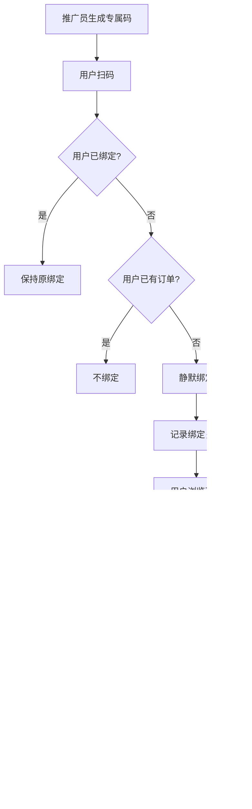

# 寻迹千行 详细设计文档

**版本：V1.0 | 日期：2026年1月**

---

# 第一部分：订单状态设计

## 1.1 订单状态定义

| 状态码 | 状态名 | 说明 | C端显示 |
|--------|--------|------|---------|
| pending_pay | 待支付 | 订单已创建，等待用户支付 | 待支付 |
| pending_confirm | 待确认 | 已支付，等待商家确认 | 待确认 |
| confirmed | 已确认 | 商家已确认，等待出行 | 待出行 |
| completed | 已完成 | 行程结束，订单完成 | 已完成 |
| cancelled | 已取消 | 用户取消或超时自动取消 | 已取消 |
| refunding | 退款中 | 用户申请退款，等待审核 | 退款中 |
| refunded | 已退款 | 退款审核通过，已退款 | 已退款 |
| rejected | 已拒绝 | 商家拒绝接单，已自动退款 | 已退款 |

## 1.2 订单状态流转图

```
                                    ┌─────────────────────────────────────────┐
                                    │                                         │
                                    ▼                                         │
┌──────────┐   用户支付    ┌──────────────┐   商家确认    ┌──────────┐       │
│          │ ──────────▶  │              │ ──────────▶  │          │       │
│ 待支付    │              │    待确认     │              │  已确认   │       │
│pending_pay│              │pending_confirm│              │confirmed │       │
│          │              │              │              │          │       │
└────┬─────┘              └──────┬───────┘              └────┬─────┘       │
     │                           │                           │             │
     │ 用户取消                   │ 商家拒绝                   │ 出行结束    │
     │ 或超时                     │ (自动退款)                 │             │
     │                           │                           ▼             │
     │                           │                     ┌──────────┐        │
     │                           │                     │          │        │
     │                           │                     │  已完成   │        │
     │                           │                     │completed │        │
     │                           │                     │          │        │
     │                           │                     └──────────┘        │
     │                           │                           │             │
     │                           ▼                           │             │
     │                     ┌──────────┐                      │             │
     │                     │          │                      │             │
     │                     │  已拒绝   │                      │             │
     │                     │ rejected │                      │             │
     │                     │          │                      │             │
     │                     └──────────┘                      │             │
     │                                                       │             │
     ▼                                                       │             │
┌──────────┐                                                 │             │
│          │                                                 │             │
│  已取消   │                                                 │             │
│cancelled │                                                 │             │
│          │                                                 │             │
└──────────┘                                                 │             │
                                                             │             │
                         ┌───────────────────────────────────┘             │
                         │ 用户申请退款                                      │
                         │ (待确认/已确认状态可申请)                          │
                         ▼                                                 │
                   ┌──────────┐                                            │
                   │          │                                            │
                   │  退款中   │────────────────────────────────────────────┘
                   │refunding │        审核驳回(恢复原状态)
                   │          │
                   └────┬─────┘
                        │
                        │ 审核通过
                        ▼
                   ┌──────────┐
                   │          │
                   │  已退款   │
                   │ refunded │
                   │          │
                   └──────────┘
```

## 1.3 状态流转规则表

| 当前状态 | 触发动作 | 目标状态 | 触发方 | 附加操作 |
|----------|----------|----------|--------|----------|
| pending_pay | 支付成功 | pending_confirm | 系统 | 扣减库存、发消息 |
| pending_pay | 用户取消 | cancelled | 用户 | 释放锁定库存 |
| pending_pay | 超时未支付 | cancelled | 系统(定时) | 释放锁定库存 |
| pending_confirm | 商家确认 | confirmed | 供应商 | 发消息通知用户 |
| pending_confirm | 商家拒绝 | rejected | 供应商 | 自动退款、释放库存、发消息 |
| pending_confirm | 用户申请退款 | refunding | 用户 | 创建退款单 |
| confirmed | 出行结束 | completed | 系统(定时) | 发放积分 |
| confirmed | 用户申请退款 | refunding | 用户 | 创建退款单、计算退款比例 |
| refunding | 审核通过 | refunded | 供应商/管理员 | 执行退款、释放库存、发消息 |
| refunding | 审核驳回 | 原状态 | 供应商/管理员 | 恢复原状态、发消息 |

## 1.4 Mermaid状态图


---

# 第二部分：支付流程设计

## 2.1 支付流程概述

```
┌─────────────────────────────────────────────────────────────────────────────┐
│                              支付流程总览                                     │
├─────────────────────────────────────────────────────────────────────────────┤
│                                                                             │
│   1. 用户提交订单                                                            │
│          ↓                                                                  │
│   2. 后端创建订单 + 锁定库存 + 创建支付记录                                    │
│          ↓                                                                  │
│   3. 调用微信支付API获取prepay_id                                            │
│          ↓                                                                  │
│   4. 返回支付参数给小程序                                                     │
│          ↓                                                                  │
│   5. 小程序调起微信支付                                                       │
│          ↓                                                                  │
│   6. 用户完成支付                                                            │
│          ↓                                                                  │
│   7. 微信异步通知后端                                                         │
│          ↓                                                                  │
│   8. 后端验签 + 更新订单状态 + 扣减库存 + 发送消息                             │
│                                                                             │
└─────────────────────────────────────────────────────────────────────────────┘
```

## 2.2 支付时序图

```
┌──────┐          ┌──────┐          ┌──────┐          ┌──────┐          ┌──────┐
│ 用户  │          │ 小程序 │          │ 后端  │          │微信支付│          │ 数据库 │
└──┬───┘          └──┬───┘          └──┬───┘          └──┬───┘          └──┬───┘
   │                 │                 │                 │                 │
   │  1.点击提交订单  │                 │                 │                 │
   │────────────────>│                 │                 │                 │
   │                 │                 │                 │                 │
   │                 │ 2.创建订单请求   │                 │                 │
   │                 │────────────────>│                 │                 │
   │                 │                 │                 │                 │
   │                 │                 │ 3.开启事务       │                 │
   │                 │                 │─────────────────────────────────>│
   │                 │                 │                 │                 │
   │                 │                 │ 4.检查库存       │                 │
   │                 │                 │<─────────────────────────────────│
   │                 │                 │                 │                 │
   │                 │                 │ 5.创建订单记录   │                 │
   │                 │                 │─────────────────────────────────>│
   │                 │                 │                 │                 │
   │                 │                 │ 6.锁定库存       │                 │
   │                 │                 │─────────────────────────────────>│
   │                 │                 │                 │                 │
   │                 │                 │ 7.创建支付记录   │                 │
   │                 │                 │─────────────────────────────────>│
   │                 │                 │                 │                 │
   │                 │                 │ 8.提交事务       │                 │
   │                 │                 │─────────────────────────────────>│
   │                 │                 │                 │                 │
   │                 │                 │ 9.调用JSAPI下单  │                 │
   │                 │                 │────────────────>│                 │
   │                 │                 │                 │                 │
   │                 │                 │ 10.返回prepay_id │                 │
   │                 │                 │<────────────────│                 │
   │                 │                 │                 │                 │
   │                 │ 11.返回支付参数  │                 │                 │
   │                 │<────────────────│                 │                 │
   │                 │                 │                 │                 │
   │                 │ 12.调起微信支付  │                 │                 │
   │                 │────────────────────────────────>│                 │
   │                 │                 │                 │                 │
   │ 13.输入密码支付  │                 │                 │                 │
   │────────────────────────────────────────────────>│                 │
   │                 │                 │                 │                 │
   │                 │ 14.支付结果      │                 │                 │
   │                 │<────────────────────────────────│                 │
   │                 │                 │                 │                 │
   │ 15.显示结果      │                 │                 │                 │
   │<────────────────│                 │                 │                 │
   │                 │                 │                 │                 │
   │                 │                 │ 16.异步通知      │                 │
   │                 │                 │<────────────────│                 │
   │                 │                 │                 │                 │
   │                 │                 │ 17.验签         │                 │
   │                 │                 │────┐            │                 │
   │                 │                 │<───┘            │                 │
   │                 │                 │                 │                 │
   │                 │                 │ 18.幂等检查     │                 │
   │                 │                 │─────────────────────────────────>│
   │                 │                 │                 │                 │
   │                 │                 │ 19.更新订单状态  │                 │
   │                 │                 │─────────────────────────────────>│
   │                 │                 │                 │                 │
   │                 │                 │ 20.确认扣减库存  │                 │
   │                 │                 │─────────────────────────────────>│
   │                 │                 │                 │                 │
   │                 │                 │ 21.发送消息通知  │                 │
   │                 │                 │────┐            │                 │
   │                 │                 │<───┘            │                 │
   │                 │                 │                 │                 │
   │                 │                 │ 22.返回SUCCESS  │                 │
   │                 │                 │────────────────>│                 │
   │                 │                 │                 │                 │
└──┴───┘          └──┴───┘          └──┴───┘          └──┴───┘          └──┴───┘
```

## 2.3 Mermaid时序图


## 2.4 支付关键逻辑

### 2.4.1 创建订单逻辑

```
创建订单流程:
┌─────────────────────────────────────────────────────────────┐
│ 1. 参数校验                                                  │
│    - 校验SKU是否存在                                         │
│    - 校验日期是否可售                                        │
│    - 校验出行人信息完整性                                    │
├─────────────────────────────────────────────────────────────┤
│ 2. 库存检查                                                  │
│    - 查询当日可用库存 = stock - sold - locked               │
│    - 判断 可用库存 >= 需求数量                               │
├─────────────────────────────────────────────────────────────┤
│ 3. 计算价格                                                  │
│    - 成人总价 = 成人价 × 成人数                              │
│    - 儿童总价 = 儿童价 × 儿童数                              │
│    - 查询可用优惠券，计算优惠金额                            │
│    - 实付金额 = 总价 - 优惠金额                              │
├─────────────────────────────────────────────────────────────┤
│ 4. 创建订单（事务）                                          │
│    - 生成订单号（雪花ID）                                    │
│    - 插入订单主表                                            │
│    - 插入出行人表                                            │
│    - 锁定库存（locked + 数量）                               │
│    - 锁定优惠券                                              │
│    - 创建支付记录                                            │
│    - 设置超时时间（30分钟）                                  │
├─────────────────────────────────────────────────────────────┤
│ 5. 调用微信支付                                              │
│    - 调用JSAPI下单接口                                       │
│    - 获取prepay_id                                          │
│    - 生成支付签名                                            │
│    - 返回支付参数                                            │
└─────────────────────────────────────────────────────────────┘
```

### 2.4.2 支付回调逻辑

```
支付回调处理:
┌─────────────────────────────────────────────────────────────┐
│ 1. 验签                                                      │
│    - 使用微信支付v3验签                                      │
│    - 验签失败返回FAIL                                        │
├─────────────────────────────────────────────────────────────┤
│ 2. 解析通知内容                                              │
│    - 解密回调数据                                            │
│    - 获取商户订单号、交易状态                                │
├─────────────────────────────────────────────────────────────┤
│ 3. 幂等检查                                                  │
│    - 查询支付记录状态                                        │
│    - 如果已处理，直接返回SUCCESS                             │
├─────────────────────────────────────────────────────────────┤
│ 4. 业务处理（事务）                                          │
│    - 更新支付记录状态                                        │
│    - 更新订单状态为 pending_confirm                          │
│    - 确认扣减库存（sold+数量, locked-数量）                  │
│    - 核销优惠券                                              │
│    - 记录推广员信息（如有绑定）                              │
├─────────────────────────────────────────────────────────────┤
│ 5. 后续处理（异步）                                          │
│    - 发送站内消息                                            │
│    - 发送微信订阅消息                                        │
│    - 通知企业微信（定制游）                                  │
├─────────────────────────────────────────────────────────────┤
│ 6. 返回结果                                                  │
│    - 返回SUCCESS                                             │
└─────────────────────────────────────────────────────────────┘
```

### 2.4.3 库存操作说明

```
库存字段说明:
┌─────────────────────────────────────────────────────────────┐
│ stock:  总库存                                               │
│ sold:   已售数量（支付成功后增加）                           │
│ locked: 锁定数量（下单未支付时增加）                         │
│                                                             │
│ 可售库存 = stock - sold - locked                            │
└─────────────────────────────────────────────────────────────┘

库存操作时机:
┌─────────────────────────────────────────────────────────────┐
│ 创建订单:  locked + 数量                                     │
│ 支付成功:  sold + 数量, locked - 数量                        │
│ 取消订单:  locked - 数量                                     │
│ 支付超时:  locked - 数量                                     │
│ 退款成功:  sold - 数量                                       │
│ 商家拒绝:  sold - 数量                                       │
└─────────────────────────────────────────────────────────────┘
```

---

# 第三部分：退款流程设计

## 3.1 退款流程概述

```
┌─────────────────────────────────────────────────────────────────────────────┐
│                              退款流程总览                                     │
├─────────────────────────────────────────────────────────────────────────────┤
│                                                                             │
│   1. 用户申请退款                                                            │
│          ↓                                                                  │
│   2. 系统计算退款比例和金额                                                   │
│          ↓                                                                  │
│   3. 创建退款单，订单状态变为"退款中"                                         │
│          ↓                                                                  │
│   4. 商家审核退款申请                                                        │
│          ↓                                                                  │
│      ┌───┴───┐                                                              │
│      ↓       ↓                                                              │
│   审核通过  审核驳回                                                         │
│      ↓       ↓                                                              │
│   调用微信  恢复订单                                                         │
│   退款接口  原状态                                                           │
│      ↓                                                                      │
│   退款到账                                                                   │
│      ↓                                                                      │
│   订单状态变为"已退款"                                                       │
│                                                                             │
└─────────────────────────────────────────────────────────────────────────────┘
```

## 3.2 退款规则

### 退款比例规则

| 申请时间 | 退款比例 | 说明 |
|---------|---------|------|
| 出发前7天（含）以上 | 100% | 全额退款 |
| 出发前3-6天 | 70% | 扣除30%手续费 |
| 出发前1-2天 | 50% | 扣除50%手续费 |
| 出发当天 | 0% | 不可退款 |

### 退款计算逻辑

```
退款金额计算:
┌─────────────────────────────────────────────────────────────┐
│ 输入:                                                        │
│   - 实付金额 (pay_amount)                                    │
│   - 出发日期 (start_date)                                    │
│   - 申请日期 (apply_date)                                    │
│                                                             │
│ 计算:                                                        │
│   1. 计算距离出发天数                                        │
│      days_diff = start_date - apply_date                    │
│                                                             │
│   2. 确定退款比例                                            │
│      if days_diff >= 7:                                     │
│          ratio = 100%                                       │
│      elif days_diff >= 3:                                   │
│          ratio = 70%                                        │
│      elif days_diff >= 1:                                   │
│          ratio = 50%                                        │
│      else:                                                  │
│          ratio = 0% (不可退款)                               │
│                                                             │
│   3. 计算退款金额                                            │
│      refund_amount = pay_amount × ratio                     │
│                                                             │
│ 输出:                                                        │
│   - 退款比例 (refund_ratio)                                  │
│   - 退款金额 (refund_amount)                                 │
└─────────────────────────────────────────────────────────────┘
```

## 3.3 退款时序图

```
┌──────┐       ┌──────┐       ┌──────┐       ┌──────┐       ┌──────┐
│ 用户  │       │ 小程序 │       │ 后端  │       │微信支付│       │ 商家  │
└──┬───┘       └──┬───┘       └──┬───┘       └──┬───┘       └──┬───┘
   │              │              │              │              │
   │ 1.申请退款   │              │              │              │
   │─────────────>│              │              │              │
   │              │              │              │              │
   │              │ 2.提交退款   │              │              │
   │              │─────────────>│              │              │
   │              │              │              │              │
   │              │              │ 3.校验订单状态              │
   │              │              │────┐         │              │
   │              │              │<───┘         │              │
   │              │              │              │              │
   │              │              │ 4.计算退款金额              │
   │              │              │────┐         │              │
   │              │              │<───┘         │              │
   │              │              │              │              │
   │              │              │ 5.创建退款单               │
   │              │              │ 6.更新订单状态(refunding)  │
   │              │              │ 7.保存原状态               │
   │              │              │────┐         │              │
   │              │              │<───┘         │              │
   │              │              │              │              │
   │              │ 8.返回成功   │              │              │
   │              │<─────────────│              │              │
   │              │              │              │              │
   │ 9.显示结果   │              │              │              │
   │<─────────────│              │              │              │
   │              │              │              │              │
   │              │              │              │ 10.审核退款  │
   │              │              │<─────────────────────────────│
   │              │              │              │              │
   │              │              │              │              │
   │              │    ┌────────────────────────────┐          │
   │              │    │ 审核通过                    │          │
   │              │    └────────────────────────────┘          │
   │              │              │              │              │
   │              │              │ 11.调用退款  │              │
   │              │              │─────────────>│              │
   │              │              │              │              │
   │              │              │ 12.退款结果  │              │
   │              │              │<─────────────│              │
   │              │              │              │              │
   │              │              │ 13.更新订单(refunded)       │
   │              │              │ 14.释放库存                 │
   │              │              │ 15.退还优惠券(如适用)       │
   │              │              │────┐         │              │
   │              │              │<───┘         │              │
   │              │              │              │              │
   │              │              │ 16.发送退款成功消息         │
   │              │              │────┐         │              │
   │ 17.收到通知  │              │<───┘         │              │
   │<──────────────────────────────────────────────────────────│
   │              │              │              │              │
   │              │    ┌────────────────────────────┐          │
   │              │    │ 审核驳回                    │          │
   │              │    └────────────────────────────┘          │
   │              │              │              │              │
   │              │              │ 18.恢复订单原状态           │
   │              │              │ 19.更新退款单状态           │
   │              │              │────┐         │              │
   │              │              │<───┘         │              │
   │              │              │              │              │
   │              │              │ 20.发送驳回消息             │
   │ 21.收到通知  │              │              │              │
   │<──────────────────────────────────────────────────────────│
   │              │              │              │              │
└──┴───┘       └──┴───┘       └──┴───┘       └──┴───┘       └──┴───┘
```

## 3.4 Mermaid时序图


## 3.5 退款状态设计

| 状态 | 状态码 | 说明 |
|------|--------|------|
| 待审核 | 0 | 用户提交退款申请 |
| 已通过 | 1 | 审核通过，已退款 |
| 已驳回 | 2 | 审核驳回 |

## 3.6 商家拒绝接单的退款

商家拒绝接单时的特殊退款流程：

```
商家拒绝接单退款:
┌─────────────────────────────────────────────────────────────┐
│ 触发: 商家点击"拒绝接单"                                     │
│                                                             │
│ 处理流程:                                                    │
│   1. 更新订单状态为 rejected                                 │
│   2. 自动创建退款单(100%退款)                                │
│   3. 调用微信退款接口                                        │
│   4. 释放库存                                                │
│   5. 退还优惠券                                              │
│   6. 发送拒单通知给用户                                      │
│                                                             │
│ 特点:                                                        │
│   - 无需用户申请                                             │
│   - 无需审核，自动执行                                       │
│   - 100%全额退款                                             │
└─────────────────────────────────────────────────────────────┘
```

---

# 第四部分：核心业务流程

## 4.1 跟团游下单流程

```
┌─────────────────────────────────────────────────────────────────────────────┐
│                            跟团游下单完整流程                                 │
└─────────────────────────────────────────────────────────────────────────────┘

┌──────────────────┐
│ 1. 浏览线路列表   │
│    - 筛选分类     │
│    - 筛选出发地   │
│    - 筛选天数     │
│    - 筛选价格     │
└────────┬─────────┘
         │
         ▼
┌──────────────────┐
│ 2. 查看线路详情   │
│    - 轮播图      │
│    - 基础信息    │
│    - 套餐列表    │
│    - 商家信息    │
└────────┬─────────┘
         │
         ▼
┌──────────────────┐
│ 3. 选择套餐      │
│    - 查看套餐详情 │
│    - 对比配置    │
└────────┬─────────┘
         │
         ▼
┌──────────────────┐
│ 4. 选择出发日期   │
│    - 日历展示    │
│    - 显示价格    │
│    - 显示库存    │
└────────┬─────────┘
         │
         ▼
┌──────────────────┐
│ 5. 选择人数      │
│    - 成人数      │
│    - 儿童数      │
│    - 计算总价    │
└────────┬─────────┘
         │
         ▼
┌──────────────────┐
│ 6. 进入确认订单   │
│    - 订单信息    │
│    - 金额明细    │
└────────┬─────────┘
         │
         ▼
┌──────────────────┐
│ 7. 填写出行人    │
│    - 添加出行人  │
│    - 或选择已有  │
│    - 姓名+身份证 │
└────────┬─────────┘
         │
         ▼
┌──────────────────┐
│ 8. 填写联系人    │
│    - 默认当前用户│
│    - 可修改      │
└────────┬─────────┘
         │
         ▼
┌──────────────────┐
│ 9. 选择优惠券    │
│    - 显示可用券  │
│    - 自动选最优  │
│    - 可手动切换  │
└────────┬─────────┘
         │
         ▼
┌──────────────────┐
│ 10. 确认退改规则 │
│    - 显示规则    │
│    - 勾选同意    │
└────────┬─────────┘
         │
         ▼
┌──────────────────┐
│ 11. 提交订单     │
│    - 创建订单    │
│    - 锁定库存    │
└────────┬─────────┘
         │
         ▼
┌──────────────────┐
│ 12. 微信支付     │
│    - 调起支付    │
│    - 输入密码    │
└────────┬─────────┘
         │
         ▼
┌──────────────────┐
│ 13. 支付成功     │
│    - 显示结果    │
│    - 查看订单    │
└──────────────────┘
```

## 4.2 Mermaid流程图


## 4.3 定制游流程

```
┌─────────────────────────────────────────────────────────────────────────────┐
│                              定制游流程                                       │
└─────────────────────────────────────────────────────────────────────────────┘

用户端:
┌──────────────────┐     ┌──────────────────┐     ┌──────────────────┐
│ 1. 选择目的地     │────>│ 2. 选择出行时间   │────>│ 3. 选择出行天数   │
│    热门卡片       │     │    快捷选项       │     │    单选按钮       │
│    其他输入       │     │    日期选择       │     │                  │
└──────────────────┘     └──────────────────┘     └──────────────────┘
                                                           │
         ┌─────────────────────────────────────────────────┘
         │
         ▼
┌──────────────────┐     ┌──────────────────┐     ┌──────────────────┐
│ 4. 选择出行人数   │────>│ 5. 选择预算范围   │────>│ 6. 选择其他需求   │
│    成人加减器     │     │    单选按钮       │     │    多选标签       │
│    儿童加减器     │     │                  │     │    补充输入       │
└──────────────────┘     └──────────────────┘     └──────────────────┘
                                                           │
         ┌─────────────────────────────────────────────────┘
         │
         ▼
┌──────────────────┐     ┌──────────────────┐     ┌──────────────────┐
│ 7. 确认联系方式   │────>│ 8. 提交需求       │────>│ 9. 提交成功页     │
│    默认手机号     │     │    发送到后端     │     │    等待联系       │
│    可修改        │     │    通知企微       │     │    30分钟内      │
└──────────────────┘     └──────────────────┘     └──────────────────┘


运营端:
┌──────────────────┐     ┌──────────────────┐     ┌──────────────────┐
│ 1. 收到企微通知   │────>│ 2. 查看需求详情   │────>│ 3. 联系用户       │
│    客服接收       │     │    管理后台       │     │    电话沟通       │
│                  │     │    标记跟进中     │     │    添加跟进记录   │
└──────────────────┘     └──────────────────┘     └──────────────────┘
                                                           │
         ┌─────────────────────────────────────────────────┘
         │
         ▼
┌──────────────────┐     ┌──────────────────┐
│ 4. 制定方案       │────>│ 5. 用户确认下单   │
│    定制行程       │     │    标记已完成     │
│    报价          │     │    或标记关闭     │
└──────────────────┘     └──────────────────┘
```

## 4.4 推广绑定流程

```
┌─────────────────────────────────────────────────────────────────────────────┐
│                              推广绑定流程                                     │
└─────────────────────────────────────────────────────────────────────────────┘

┌──────────────────┐
│ 推广员分享小程序码 │
└────────┬─────────┘
         │
         ▼
┌──────────────────┐
│ 用户扫码打开小程序 │
└────────┬─────────┘
         │
         ▼
┌──────────────────┐     ┌──────────────────┐
│ 检查用户是否已绑定 │────>│ 已绑定           │────> 不覆盖，保持原绑定
└────────┬─────────┘     └──────────────────┘
         │ 未绑定
         ▼
┌──────────────────┐     ┌──────────────────┐
│ 检查是否为新用户   │────>│ 非新用户(已下单)  │────> 不绑定
└────────┬─────────┘     └──────────────────┘
         │ 新用户
         ▼
┌──────────────────┐
│ 静默绑定推广员     │
│ - 记录绑定时间    │
│ - 更新推广员统计  │
└────────┬─────────┘
         │
         ▼
┌──────────────────┐
│ 用户正常使用小程序 │
└────────┬─────────┘
         │
         ▼
┌──────────────────┐     ┌──────────────────┐
│ 用户下单支付成功   │────>│ 记录订单推广员    │
└────────┬─────────┘     └──────────────────┘
         │
         ▼
┌──────────────────┐
│ 订单完成          │
└────────┬─────────┘
         │
         ▼
┌──────────────────┐     ┌──────────────────┐
│ 发放推广积分       │────>│ 解除绑定关系      │
│ 给推广员          │     │ (首单完成后)      │
└──────────────────┘     └──────────────────┘
```

## 4.5 Mermaid推广流程图



---

# 第五部分：会员与领队流程

## 5.1 会员开通流程


## 5.2 领队申请流程


---

# 第六部分：消息通知流程

## 6.1 消息触发机制

```
┌─────────────────────────────────────────────────────────────────────────────┐
│                           消息触发流程                                        │
└─────────────────────────────────────────────────────────────────────────────┘

业务事件触发:
┌──────────────────┐     ┌──────────────────┐     ┌──────────────────┐
│ 业务操作          │────>│ 发布Spring Event │────>│ 消息监听器        │
│ (支付/确认/退款)  │     │                  │     │                  │
└──────────────────┘     └──────────────────┘     └────────┬─────────┘
                                                           │
                              ┌────────────────────────────┴────────────────┐
                              │                                             │
                              ▼                                             ▼
                    ┌──────────────────┐                        ┌──────────────────┐
                    │ 保存站内消息       │                        │ 发送微信订阅消息   │
                    │ (message_record) │                        │ (异步)           │
                    └──────────────────┘                        └──────────────────┘


定时任务触发(出行提醒):
┌──────────────────┐     ┌──────────────────┐     ┌──────────────────┐
│ 每日定时任务       │────>│ 查询明天出发订单   │────>│ 批量生成提醒消息   │
│ (如每天8:00)      │     │                  │     │ + 发送订阅消息    │
└──────────────────┘     └──────────────────┘     └──────────────────┘
```

## 6.2 消息类型与触发时机

| 消息类型 | 触发时机 | 站内消息 | 订阅消息 |
|---------|---------|---------|---------|
| 支付成功 | 支付回调成功 | Y | Y |
| 订单确认 | 商家点击确认 | Y | Y |
| 订单拒绝 | 商家点击拒绝 | Y | Y |
| 出行提醒 | 出发前1天(定时) | Y | Y |
| 退款申请 | 用户提交退款 | Y | N |
| 退款成功 | 退款审核通过 | Y | Y |
| 退款驳回 | 退款审核驳回 | Y | Y |
| 会员到期 | 到期前7天(定时) | Y | N |

---

# 附录：状态码速查表

## 订单状态

| 状态码 | 说明 | 可流转到 |
|--------|------|---------|
| pending_pay | 待支付 | pending_confirm, cancelled |
| pending_confirm | 待确认 | confirmed, rejected, refunding |
| confirmed | 已确认 | completed, refunding |
| completed | 已完成 | - |
| cancelled | 已取消 | - |
| refunding | 退款中 | refunded, pending_confirm, confirmed |
| refunded | 已退款 | - |
| rejected | 已拒绝 | - |

## 退款状态

| 状态码 | 说明 |
|--------|------|
| 0 | 待审核 |
| 1 | 已通过 |
| 2 | 已驳回 |

## 支付状态

| 状态码 | 说明 |
|--------|------|
| 0 | 待支付 |
| 1 | 已支付 |
| 2 | 已关闭 |

---

*— 文档结束 —*

**版本历史**

| 版本 | 日期 | 说明 |
|------|------|------|
| V1.0 | 2026-01 | 初稿，包含订单/支付/退款/核心业务流程设计 |
